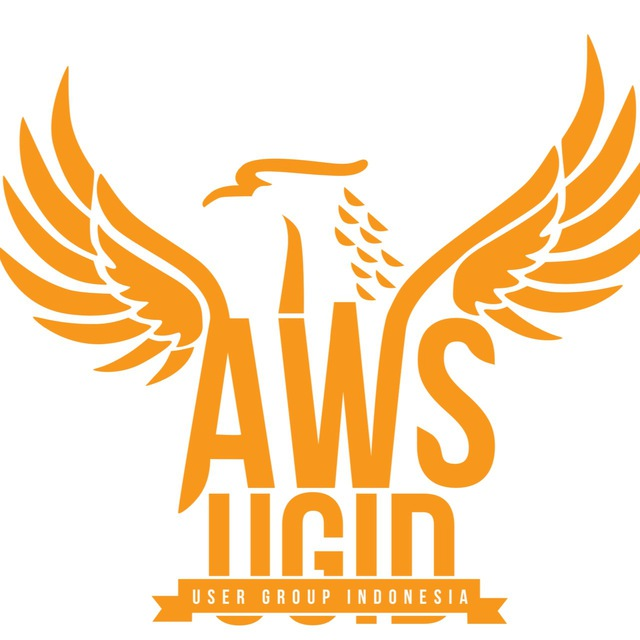

# AWS User Group Indonesia

## Halo Semua!

Selamat datang di repositori `talks`! Di sini kamu bisa temukan sesi menarik seputar Amazon Web Services yang sudah pernah dibahas oleh pembicara-pembicara keren di channel youtube AWS User Group Indonesia, loh!

## Forum Diskusi

Ada pertanyaan seputar topik atau materi? Yuk ke [forum diskusi](https://github.com/awsugid/forum/discussions) untuk bertanya atau berdiskusi seputar AWS dengan pengguna lain. Mari saling berbagi ilmu!

## Mari Bergabung

Gabung dan ikuti media sosial Komunitas AWS User Group Indonesia:
- [Twitter](https://twitter.com/AWSUserGroupID/)
- [Telegram](https://t.me/AWSUserGroupID)
- [Instagram](https://instagram.com/awsugid)
- [LinkedIn Page](https://www.linkedin.com/company/awsugid)
- [Facebook Group](https://web.facebook.com/groups/awsindonesia)

### Tim

Repository ini dikelola oleh:

- [Albert Suwandhi (AWS Community Hero)](https://www.linkedin.com/in/albertsuwandhi/)
- [Ananda Dwi Rahmawati(AWS Container Hero)](https://www.linkedin.com/in/anandadwir/)
- [Setia Budi (AWS Community Hero)](https://www.linkedin.com/in/boedybios/)

### Umpan Balik

Ada ide menarik untuk pengembangan? Ada pertanyaan? Bagikan dengan kami!
